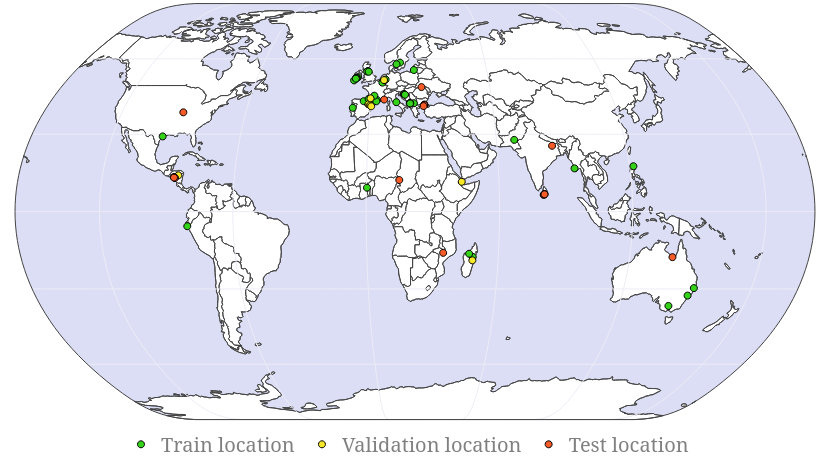

# [Kuro Siwo: A global multi-temporal SAR dataset for rapid flood mapping](https://arxiv.org/abs/2311.12056)

  #### Latest updates:
    - [✔️] Update codebase for KuroSiwo v2 + updated mean/stds
    - [✔️] Updated citation 
    - [ ] TODO: Expand README with more elaborate guidelines
    - [ ] TODO: Upload Kuro-Siwo to HuggingFace




# Table of Contents
- [Download the dataset](#download-kuro-siwo)
- [Data preprocessing](#data-preprocessing)
- [Repository structure](#kuro-siwo-repo-structure)
- [Pretrained models](#pretrained-models)
- [Citation](#citation)


### Download Kuro Siwo

  #### GRD Data
- The Kuro Siwo GRD Dataset can be downloaded either:
  - from the following [link](https://www.dropbox.com/scl/fo/xc69aclh0q4lykd22ynkb/AAaDu8gBtoSdOpmffv7JY50?rlkey=uds2b2aot6oubc9hmnrm7myy7&st=21u41kwx&dl=0),


  - or by executing ```scripts/download_kuro_siwo.sh```. This script will download and prepare the Kuro Siwo GRDD dataset for deep learning.

    #### Usage 

    1. Make sure to grant the necessary rights by executing `chmod +x scripts/download_kuro_siwo.sh`
    2. Execute `scripts/download_kuro_siwo.sh DESIRED_DATASET_ROOT_PATH` e.g: `./download_kuro_siwo.sh KuroRoot`


#### SLC Data
  - The SLC Preprocessed products can be downloaded from the following [link](https://www.dropbox.com/scl/fo/kknf6ycz6ywffopjxroys/AOIedl2NgWnOXQBEDUGv4m0?rlkey=rb18w8rzpwitg2w3nlhzklnyy&st=p1vv516h&dl=0).

  - Similarly, the cropped SLC patches (224x224 pixels) can be acquired from the following [link](https://www.dropbox.com/scl/fo/6u1bhbhd34rnn0u47o8dj/AK9vblAzDWqhPTqYvioPUb8?rlkey=i7k862563n936akuqlsdf3w66&st=0f7q3vno&dl=0).  


### Data preprocessing

The preprocessing pipelines used to generate the GRD and SLC products can be found at `configs/grd_preprocessing.xml` and `configs/slc_preprocessing.xml` repsectively.


### Kuro Siwo repo structure 
  - Kuro Siwo uses the [black](https://github.com/psf/black) python formatter. To activate it install pre-commit, running `pip install pre-commit`
and execute `pre-commit install`.
  - Training starts by running `python main.py`. The configurations are defined in the `configs` directory
 e.g 
    - model,
    - training pipeline 
      - Segmentation,
      - change detection
    - hyperparameters
  - `main.py` supports command line arguments that override the config files.
     e.g 
      ```
         python main.py --method=unet --backbone=resnet18 --dem=True --slope=False --batch_size=32
      ```


### Pretrained models
The weights of the top performing models can be accessed using the following links:
  - [FloodViT](https://www.dropbox.com/scl/fi/srw7u4cw1gtxrf4xzmsh7/floodvit.pt?rlkey=snskpq1qrdav5u2jya8k2bocg&dl=0)
  - [SNUNet](https://www.dropbox.com/scl/fi/3vlsveoobqe1wc71s5z2d/best_segmentation.pt?rlkey=xpy2thmozzxfzymr8b13m7n51&dl=0)


### Citation
If you use this work please cite:
```
@inproceedings{NEURIPS2024_43612b06,
 author = {Bountos, Nikolaos Ioannis and Sdraka, Maria and Zavras, Angelos and Karavias, Andreas and Karasante, Ilektra and Herekakis, Themistocles and Thanasou, Angeliki and Michail, Dimitrios and Papoutsis, Ioannis},
 booktitle = {Advances in Neural Information Processing Systems},
 editor = {A. Globerson and L. Mackey and D. Belgrave and A. Fan and U. Paquet and J. Tomczak and C. Zhang},
 pages = {38105--38121},
 publisher = {Curran Associates, Inc.},
 title = {Kuro Siwo: 33 billion m\^{}2 under the water. A global multi-temporal satellite dataset for rapid flood mapping},
 url = {https://proceedings.neurips.cc/paper_files/paper/2024/file/43612b0662cb6a4986edf859fd6ebafe-Paper-Datasets_and_Benchmarks_Track.pdf},
 volume = {37},
 year = {2024}
}
```
